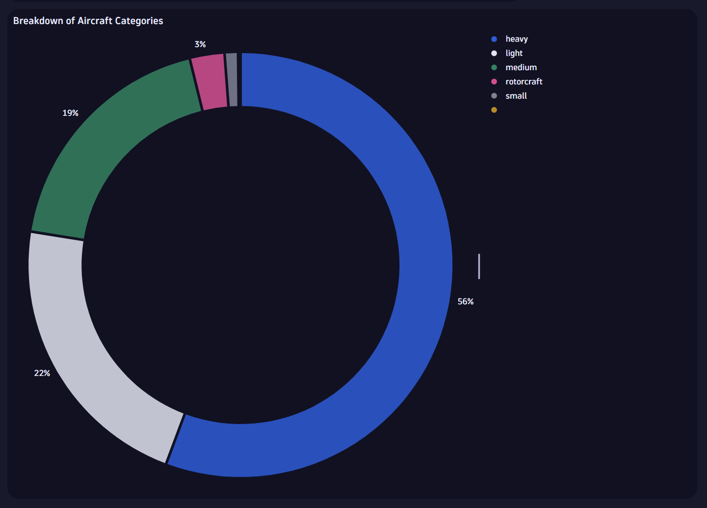
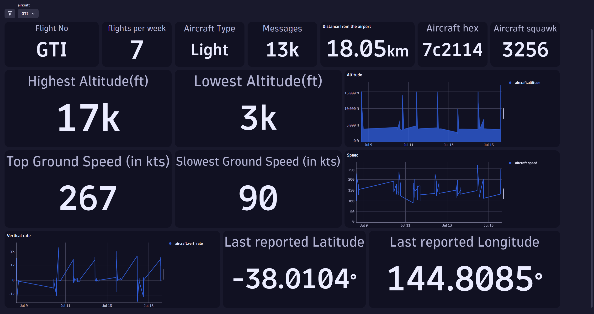

# OpenTelemetry and Dynatrace IoT Dashboards for Aircraft monitoring

This repository contains all the JSON files for dashboards related to the blog [Leverage Edge IoT Data with OpenTelemetry and Dynatrace](https://www.dynatrace.com/news/blog/leverage-edge-iot-data-with-opentelemetry-and-dynatrace/). These dashboards are designed to help visualize and analyze aircraft data using OpenTelemetry and Dynatrace.

## Blog

[Leverage Edge IoT Data with OpenTelemetry and Dynatrace](https://www.dynatrace.com/news/blog/leverage-edge-iot-data-with-opentelemetry-and-dynatrace/)

## Dashboards Included

Below are the screenshots of the dashboard tiles and dashboards included in this repository:

### Altitude of the Aircraft Tile

### Breakdown of Aircraft Categories

### Flight Count

### Flight Stats

### Flight Analysis with Distance

## How to Use

1. Set up the hardware and configure it to send the `aircraft.json` logs to Dynatrace by following the steps [outlined](https://www.dynatrace.com/news/blog/leverage-edge-iot-data-with-opentelemetry-and-dynatrace/).
2. Download the JSON files from this repository.
3. Import the JSON files into your Dynatrace environment.
4. Customize the dashboards as needed to suit your monitoring requirements.

For more details on setting up and using these dashboards, please refer to the blog post linked above.

Feel free to contribute to this repository by adding more dashboards or suggesting improvements!

## Additional Resources

This repository also contains a Dynatrace Notebook `Notebook-Flight_Stats.json` that provides additional analytics on flight data. The output of the Notebook is available in `Notebook-PrintView.pdf`

