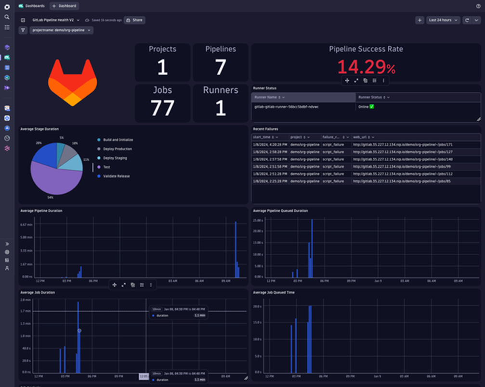

# GitLab Observability

Download and import this [dashboard from here](GitLab%20Pipeline%20Health%20(Trace%20Based).json)

Still work in progress - but - for GitLab Observability we can leverage
* OpenTelemetry for pushing Traces for GitLab Pipeline Executions
* Prometheus
* Logs

## OpenTelemetry

Please follow the instructions on pushing OTel traces from your GitLab Pipelines to an OTel Collector or directly to Dynatrace as explained here: https://github.com/dynatrace-ace/opentelemetry-gitlab 

Additionally please help us comment on the GitLab public issue for [CI/CD Observability with OpenTelemetry](https://gitlab.com/gitlab-org/gitlab/-/issues/338943)
