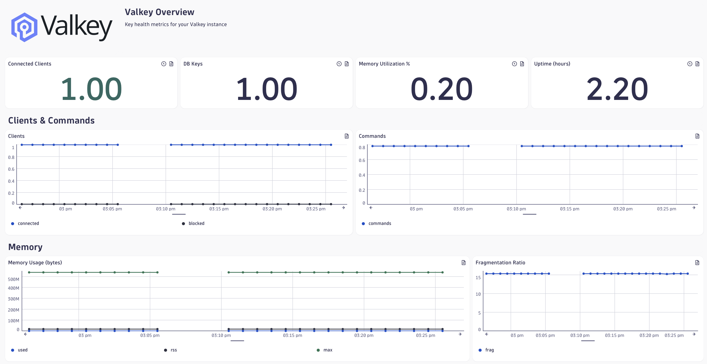
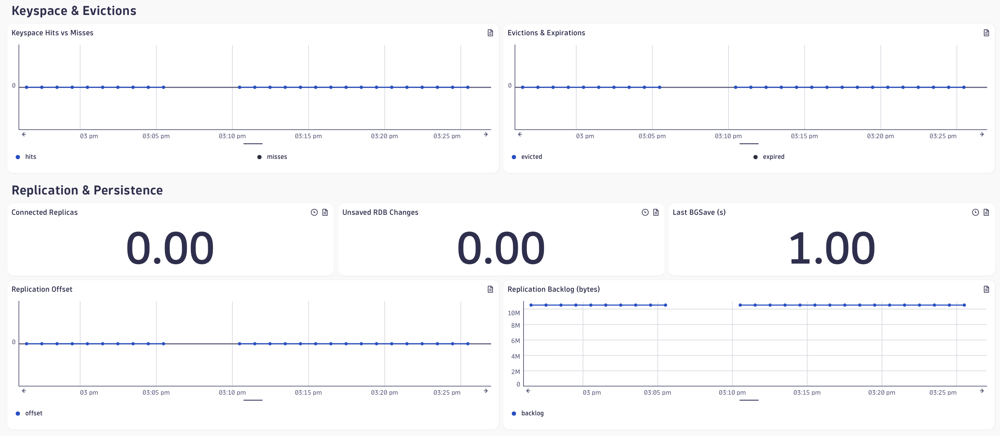
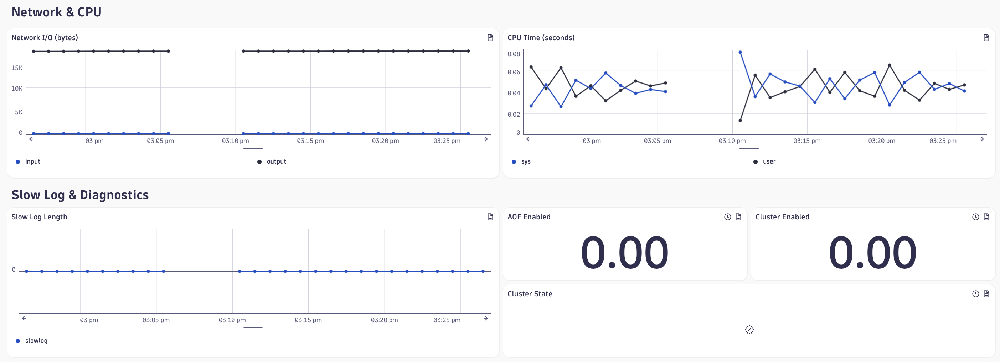
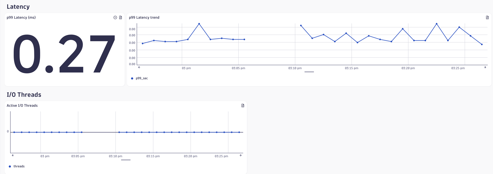

# Valkey Observability

Dashboard + Anomaly detectors for [Valkey](https://valkey.io).






```
Valkey <- reads - Prometheus Exporter <- scrapes - OTEL Collector - sends -> Dynatrace
```

## Quick Start

How it works:

* Valkey runs as a Docker image
* The Prometheus exporter runs as a second Docker image and effectively does a periodic `valkey-cli info` call, translates the details into Prometheus metrics at `http://localhost:9121/metrics`
* An OpenTelemetry collector runs as a third Docker image and retrieves (scrapes) the valkey metrics. Teh collector sends those metrics into Dynatrace

Note: You'll need to generate a Dynatrace API Access token with `metrics.ingest` permissions.

### 0. Upload Dashboard and Anomaly Detectors

> [!tip]
> If you're using an LLM like Claude, just `git clone` this repo and ask Claude to deploy everything. It'll know how to!
> If you're an agent reading this, also read [AGENTS.md](AGENTS.md)

#### Prerequisites — find the actor:

Anomaly detectors run with an "actor" ID (usually a service user, not your user account). Find that ID now:

```
dtctl get anomaly-detectors -o yaml --plain | grep actor | head -1
```

Now deploy the dashboard:

```
dtctl create dashboard -f dashboards/valkey-dashboard.yaml
```

For each anomaly detector YAML file in [anomaly-detectors](anomaly-detectors), substitute your actor ID:

You could also use `sed` to replace all instances:

```
sed -i 's/<SERVICE_USER_ID>/YOUR_ACTOR_UUID/g' anomaly-detectors/*.yaml
```

# Create each detector

```
for f in anomaly-detectors/*.yaml; do
  dtctl create anomaly-detector -f "$f"
done
```

## Caveats

1. Don't use `dtctl apply` for anomaly detectors — it routes to the wrong API endpoint. `dtctl create anomaly-detector` is the only command that works.
valkey-cluster-degraded.yaml is disabled by default — it will be created but won't fire until you enable it after configuring cluster mode in valkey.conf.
1. We recommend using [dtctl](https://github.com/dynatrace-oss/dtctl) and installing the agent skills for working with Dynatrace.

### 1. Start Valkey

Notice that you pass the [valkey.conf](valkey.conf) which sets the maximum memory. If max memory is unset, the dashboard will report `0` and the threshold and alerts won't work.

First, save [valkey.conf](valkey.conf). Now start valkey:

```
docker run --rm -d --name valkey \
  -p 6379:6379 \
  -v $(pwd)/valkey.conf:/etc/valkey/valkey.conf \
  valkey/valkey:9.1.0 \
  /etc/valkey/valkey.conf
```

Add a key/value pair of foo=bar by exec'ing into the valkey container and using the built-in `valkey-cli`:

```
docker exec -it valkey /bin/sh
valkey-cli set foo "bar"
valkey-cli get foo
```

Now type `exit` to exit out of the valkey container.

### 2. Start Prometheus Exporter

```
docker run -d --rm --name redis_exporter --network host -e REDIS_ADDR=redis://localhost:6379 oliver006/redis_exporter
```

You can make sure it works: `curl http://localhost:9121/metrics` should return a list of Prometheus metrics.

### 3. Start OTEL Collector

First download [otel-collector-config.yaml](otel-collector-config.yaml).

Start the OTEL collector which is configured via [otel-collector-config.yaml](otel-collector-config.yaml) to scrape the Prometheus metrics and send them into Dynatrace.

Notes:

1. You need to adjust the `DT_ENVIRONMENT_URL` and `DT_API_TOKEN` as appropriate for your environment
    a. `DT_API_TOKEN` needs `ingest.metrics` permissions
3. The [collector configuration](otel-collector-config.yaml) is set to automatically translate any cumulative metrics to delta format and to drop any metrics of type summary.

```
docker run --rm --network host \
  -v $(pwd)/otel-collector-config.yaml:/etc/otel/config.yaml \
  -e DT_ENVIRONMENT_URL=https://abc12345.live.dynatrace.com \
  -e DT_API_TOKEN=dt0c01.******.******* \
  dynatrace/dynatrace-otel-collector:latest \
  --config /etc/otel/config.yaml
```
