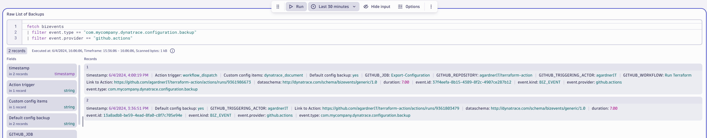
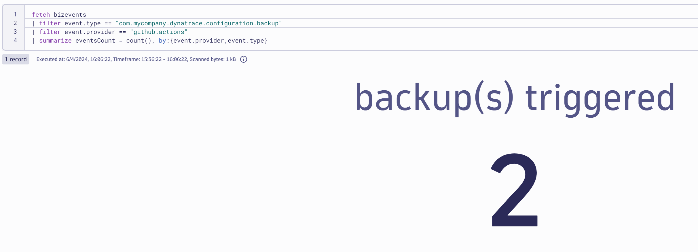
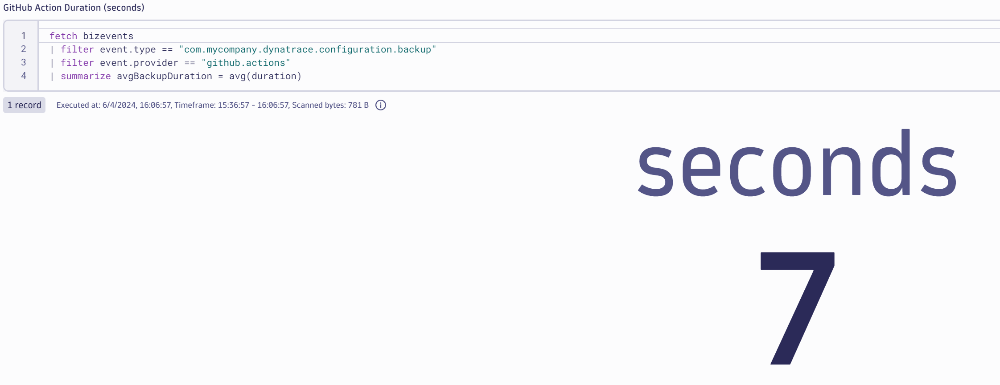

# How to Observe GitHub Actions

It is possible to fully observe GitHub actions in Dynatrace simply by sending a POST request using cURL. Here's how.

## Create API Token
Create an API token with `bizevents.ingest` permissions

## Modify your GitHub Action

The `source` and `type` fields are just samples - set these to whatever you wish.
The `data` block is a freeform field. It is your place to add any important information you need. Format is: `"key": "value"`
```
name: Sample Action
on: workflow_dispatch

jobs:
  Export-Configuration:
# GitHub requires that you create an environment
# Then you create secrets inside that env
# My environment was called `DUMMY`
#    environment: DUMMY
    runs-on: ubuntu-latest
    steps:

      - name: "Note start time"
        run: >
          echo "GHA_START_TIME=$(date +%s)" >> "$GITHUB_ENV"

      - name: Sleep
        run: sleep 5

      - name: "Send bizevent"
        run: >
            endTime=$(date +%s) &&
            local_time_diff=$(($endTime - $GHA_START_TIME)) &&
            local_bizevent_uuid=$(uuidgen) &&
            curl -X POST "${{ secrets.DYNATRACE_ENV_URL }}/api/v2/bizevents/ingest" \
              -H "accept: application/json; charset=utf-8" \
              -H "Authorization: Api-Token ${{ secrets.DT_BUSINESS_EVENT_TOKEN }}" \
              -H "Content-Type: application/cloudevent+json" \
              -d "{ \
                    \"specversion\": \"1.0\", \
                    \"id\": \"$local_bizevent_uuid\", \
                    \"source\": \"github.actions\", \
                    \"type\": \"com.mycompany.dynatrace.configuration.backup\", \
                    \"dataschema\": \"http://dynatrace.com/schema/bizevents/generic/1.0\", \
                    \"data\": { \
                        \"duration\": $local_time_diff, \
                        \"Link to Action\": \"https://github.com/$GITHUB_REPOSITORY/actions/runs/$GITHUB_RUN_ID\",
                        \"GITHUB_TRIGGERING_ACTOR\": \"$GITHUB_TRIGGERING_ACTOR\",
                        \"GITHUB_JOB\": \"$GITHUB_JOB\", \
                        \"GITHUB_REPOSITORY\": \"$GITHUB_REPOSITORY\", \
                        \"GITHUB_WORKFLOW\": \"$GITHUB_WORKFLOW\", \
                        \"Action trigger\": \"$GITHUB_EVENT_NAME\" \
                    } \
                  }"
```

## Show data in Dynatrace

### Raw View of all GitHub Action Runs



```
fetch bizevents
| filter event.type == "com.mycompany.dynatrace.configuration.backup"
| filter event.provider == "github.actions"
```

### Number of Runs by Provider and Type
Count the nubmer of runs, split by the `type` field (which you can set to anything).



```
fetch bizevents
| filter event.type == "com.mycompany.dynatrace.configuration.backup"
| filter event.provider == "github.actions"
| summarize eventsCount = count(), by:{event.provider,event.type}
```

### Show Average Duration of GitHub Action Runs



```
fetch bizevents
| filter event.type == "com.mycompany.dynatrace.configuration.backup"
| filter event.provider == "github.actions"
| summarize avgBackupDuration = avg(duration)
```
